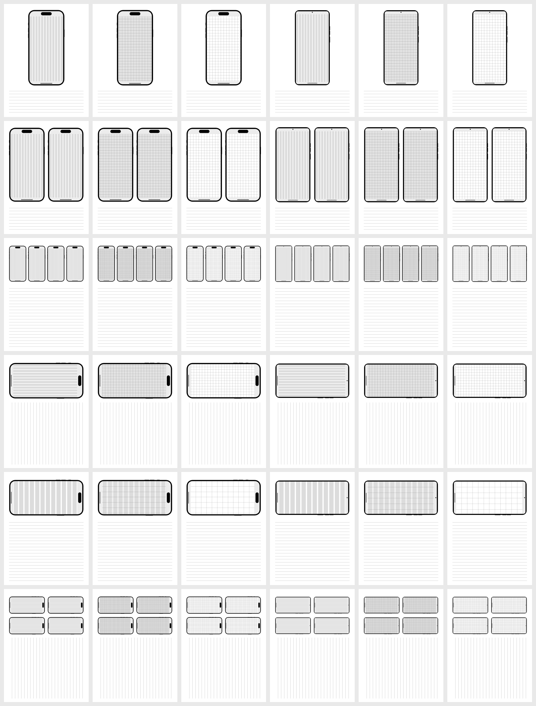

# Mobile UX Sketching Templates for reMarkable

Wireframing/UX page templates for the **reMarkable Paper Pro** and **reMarkable 2** — accurate
iPhone and Android device frames with safe-area shading, a 12-column layout grid, and a fine
drawing grid, sized to real device aspect ratios. Built in the reMarkable **"Methods"** format
(survives software updates). This repo includes the finished templates **and** the source that
generates them.



---

## ⚡ Just here to install the templates?

You'll do a quick one-time setup so your computer can talk to the tablet, then run a single
command. **Connect the reMarkable with its USB cable** for all of this.

**1) One-time setup — turn on SSH access and get your password**

- **reMarkable Paper Pro:** you must enable **Developer Mode**, which **erases the tablet**
  (back up / sync first). Full walkthrough: **[INSTALL — Paper Pro](docs/install-paper-pro.md)**.
- **reMarkable 2:** no Developer Mode needed. Full walkthrough:
  **[INSTALL — reMarkable 2](docs/install-rm2.md)**.

Both guides also show where to find your device's **password** (on the tablet:
_Settings → General → Help → About → Copyrights and licenses → "GPLv3 Compliance"_).

**2) Run the installer** (replace `YOURNAME` with this repo's GitHub owner):

macOS / Linux — open **Terminal** and paste:

```bash
REPO=Martes-Delta-Co/Remarkable-Mobile-Prototyping-Templates.git bash <(curl -fsSL https://raw.githubusercontent.com/Martes-Delta-Co/Remarkable-Mobile-Prototyping-Templates.git/main/install.sh)
```

Windows — open **PowerShell** and paste:

```powershell
$env:REPO="Martes-Delta-Co/Remarkable-Mobile-Prototyping-Templates.git"; iwr -useb https://raw.githubusercontent.com/Martes-Delta-Co/Remarkable-Mobile-Prototyping-Templates.git/main/install.ps1 | iex
```

It downloads the templates, copies them to the tablet (**it asks for the device password —
that's expected**), and restarts the interface. On the tablet: **New page → Template**.

Prefer not to use a script? Both guides above include a plain copy-the-files method and a
no-terminal drag-and-drop option (WinSCP / Cyberduck).

**Remove them later:**

```bash
ssh root@10.11.99.1 'rm -rf /home/root/.local/share/remarkable/xochitl/uxtpl_* ; systemctl restart xochitl'
```

(Everything is namespaced `uxtpl_`, so this only removes these templates.)

---

## What's in the set

**36 templates** = 2 devices × 6 layouts × 3 content variants.

- **Devices:** iPhone (Dynamic Island), Android (punch-hole).
- **Layouts:** `1UP`, `2UP`, `4UP`, `1UP LS` (landscape page), `1UP WIDE` (landscape phone),
  `4UP LS`.
- **Variants:** `COL` (12-column shading) · `COL GRD` (columns + grid) · `GRD` (grid only).

Picker names: `{1|2|4}UP [LS] [WIDE] [COL] [GRD] {iPhone|Android}` (e.g. `1UP COL iPhone`,
`1UP LS COL GRD iPhone`, `4UP LS COL Android`). Each has a thumbnail. Works on both devices
(one universal set; templates scale to the screen). Requires reMarkable software **3.17+**.

---

## Build / customize from source

The templates are generated by small Python scripts (generation is **stdlib-only**):

```bash
cd src
python3 build.py            # regenerates templates/universal/
python3 render_previews.py  # optional previews; needs: pip install -r requirements.txt
```

Where to tweak:

- **Colors / line weights:** constants at the top of `src/gen_methods.py`
  (`COL`, `UNSAFE`, `GRID_STROKE`, `NOTE_STROKE`).
- **Layouts / sizes / margins:** `layout_boxes()` and `M` in `src/gen_templates.py`.
- **Device dimensions / notch / buttons:** the `ANDROID` / `IPHONE` dicts in `src/gen_templates.py`.
- **Column count / grid density:** `n = 12`, `gutter_frac`, `cell = sw/12` in `src/gen_methods.py`.
- **Thumbnails:** `src/make_icons.py`.

## How the format works

See **[docs/methods-format-notes.md](docs/methods-format-notes.md)** for reverse-engineered
notes on the reMarkable "Methods" template format (file structure, the
`templateWidth`/`templateHeight` scaling trick, what `fillColor` / strokes / even-odd holes
do, and pitfalls — e.g. curve commands blank a template).

## Repository layout

```
templates/universal/   the 36 templates (108 files) + MANIFEST
docs/                  install guides (Paper Pro, rM2) + Methods-format notes
src/                   the generators (Python) + build/preview scripts
preview/               images used by this README
install.sh / .ps1      one-command installers
```

## License

[MIT](LICENSE). Template designs free to use; attribution appreciated. (Prefer CC-BY-4.0 for
the artwork? Swap the `LICENSE` file.)

## Disclaimer

The reMarkable "Methods" format is undocumented and community-reverse-engineered; treat it as
empirical. Not affiliated with reMarkable AS. Enabling Developer Mode and copying files to the
device is at your own risk.
